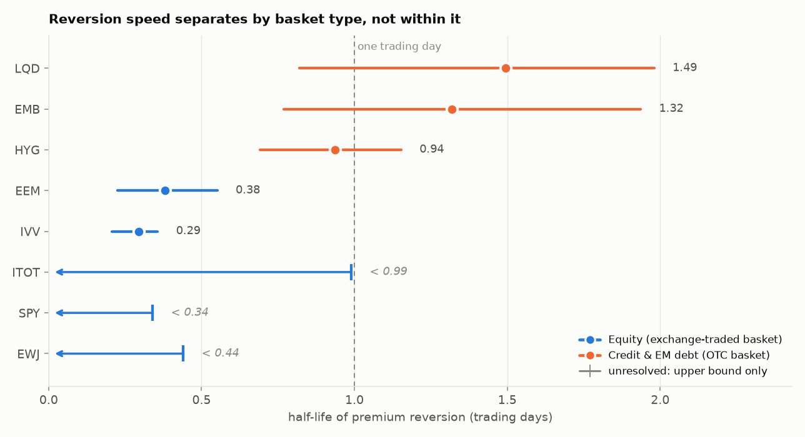

# ETF Premium / Discount & Arbitrage Dynamics

Measures how far ETF market prices drift from net asset value, how that gap closes, and why the
answer differs across asset classes.

**Eight US-listed ETFs · 2018-01-02 to 2026-09-11 · ~2,185 trading days each · NAV from issuer
files**

---

## Headline result: arbitrage has a price, and it scales with the basket

ETF premiums do not revert to zero. They revert to a **floor**, and that floor is the cost of
assembling the underlying basket:

| Fund | Underlying | Premium floor |
|---|---|---|
| `IVV` / `SPY` | S&P 500 | **+0.3 bps** |
| `ITOT` | US total market | +0.9 bps |
| `LQD` | Investment grade credit | **+10.0 bps** |
| `HYG` | High yield credit | **+18.0 bps** |
| `EMB` | EM USD debt | **+28.4 bps** |

An arbitrageur closes a 60 bp gap in `HYG` happily. At 18 bps there is nothing left after paying
the bid-ask on several hundred bonds that may not have traded today, so the gap sits there. The
floor rises monotonically with how hard the basket is to trade — an **80× spread** from large-cap
equity to emerging market debt.

This is the direct answer to *"why isn't the bond ETF discount free money?"* It isn't free money
because it is the same size as the cost of collecting it.

## Reversion speed separates by basket type — but not within it



| | overlapping pairs |
|---|---|
| equity vs credit | **0 of 6** — separated |
| credit vs credit | **3 of 3** — unresolved |

Equity reverts faster than credit and EM debt, firmly. The ordering *within* credit does not
survive its own confidence intervals and is reported as unresolved rather than ranked. `LQD`
appearing slower than `HYG` looks like a finding in the point estimates; its interval contains
`HYG`'s entirely, so it is noise.

No line is fitted and no R² is quoted. Eight funds can describe a relationship, not estimate one.

---

## Results

| Ticker | Group | n | Mean premium | SD | Range | % days at premium | Resolution | Half-life | 95% CI |
|---|---|---|---|---|---|---|---|---|---|
| `IVV` | equity | 2,185 | +0.35 bps | 4.09 | −79 / +43 | 59.2% | identified (sub-daily) | 0.29 d | [0.21, 0.36] |
| `EEM` | equity | 2,185 | −3.61 bps | 52.47 | −527 / +313 | 46.7% | identified (sub-daily) | 0.38 d | [0.23, 0.55] |
| `HYG` | credit | 2,185 | +17.97 bps | 30.74 | −166 / +459 | 82.0% | identified (sub-daily) | 0.94 d | [0.69, 1.15] |
| `EMB` | credit | 2,185 | +28.42 bps | 46.93 | −772 / +268 | 86.4% | identified | 1.32 d | [0.77, 1.94] |
| `LQD` | credit | 2,185 | +10.03 bps | 32.08 | −508 / +504 | 77.8% | identified | 1.49 d | [0.82, 1.98] |
| `ITOT` | equity | 2,185 | +0.94 bps | 5.11 | −46 / +102 | 61.4% | unresolved | < 0.99 d (fit 0.47) | — |
| `EWJ` | equity | 2,185 | +3.39 bps | 59.45 | −692 / +534 | 58.1% | unresolved | < 0.44 d (fit 0.30) | — |
| `SPY` | equity | 2,184 | +0.32 bps | 4.72 | −80 / +90 | 57.7% | unresolved | < 0.34 d | — |

Intervals are stationary block bootstrap (2,000 replicates), cross-checked against the delta
method. **Every half-life carries a resolution label** — no unlabelled numbers.

- **`identified`** — distinguishable from both a random walk and white noise, half-life longer than
  one sampling interval.
- **`identified (sub-daily)`** — statistically real, but the estimate falls *below* one trading day,
  so most of the decay happens between observations. An order of magnitude, not a measurement.
- **`unresolved`** — persistence is not distinguishable from zero. Only an upper bound is warranted.
  A tight bound (`SPY`, < 0.34 d) means reversion genuinely is fast; a loose one (`ITOT`, < 0.99 d)
  means it is unmeasurable here. The fitted value is shown beside the bound so the two cannot be
  confused.

---

## The premium measures three different things

The same arithmetic — price over NAV, minus one — is not the same quantity across the universe.
Reading it uniformly is the largest misinterpretation this data invites.

| Fund type | What the premium measures | Is it an opportunity? |
|---|---|---|
| Large-cap equity | Almost nothing, under 1 bp | **No** — arbitrage closes it before the next observation |
| Credit & EM debt | The cost of assembling the basket | **No** — it *is* the cost |
| Time-zone (`EWJ`, `EEM`) | How stale the foreign close is | **No** — already quoted in futures |

Three funds, three different reasons, none of them "the market is wrong."

### The time-zone case

`EWJ` has the widest deviations in the sample (±5%) and almost no day-to-day persistence. Tokyo is
shut throughout the US session, so NAV is struck on a stale close and cannot move; overnight the
basket reprices and the gap disappears.

The premium therefore **predicts** the next Tokyo session — slope **+0.92** (t = 18.2, R² = 0.140),
nearly one-for-one. That is not NAV measurement error: the Nikkei is computed in Tokyo and shares
no input with iShares' valuation.

**But it is not tradeable.** CME Nikkei futures trade nearly 24 hours, so the price of Japan risk
keeps updating while Tokyo cash is shut:

```
EWJ premium  vs  Nikkei futures, SAME day    slope +1.031   t = 23.0   R² 0.195
EWJ premium  vs  Nikkei futures, NEXT day    slope -0.135   t = -2.7   R² 0.003
```

The premium moves one-for-one with futures that have **already traded**. It is not a forecast but a
measurement of how far the stale Tokyo cash close has drifted from a market quoted continuously
elsewhere. Predicting a stale benchmark is easy and worthless. (71% of the apparently predictable
move also lands in the untradeable opening gap.)

Full argument in [`notebooks/02_time_zone_case.ipynb`](notebooks/02_time_zone_case.ipynb).

---

## What makes the numbers defensible

Each of these corresponds to a way the result could have been quietly wrong.

**Unadjusted prices only.** NAV as published is not dividend-adjusted. Pairing it with an adjusted
price series manufactures a drift that grows with every distribution. On `HYG` the two series
differ by **58.9% in 2018**, converging to 0% today — a fake ~5,900 bp discount trending to zero
that would swamp every real signal. The failure is silent, since `auto_adjust=True` still returns a
column called `Close`, so the loader checks for the *presence* of `Adj Close` instead.

**Strict inner join, never forward-fill NAV.** Carrying a stale NAV across a gap creates a fake
premium on the gap day and a fake reversal the next — precisely the pattern the estimator detects.
The pipeline would discover its own imputation and report it as arbitrage. Two real cases were
dropped: iShares published NAV for `HYG` on Good Friday and Easter Sunday 2024.

**Estimator validated against known parameters.** Half-life estimation has standard sign and log
errors that produce plausible-but-wrong numbers. The estimator recovers simulated OU half-lives
across 0.25–10 days before being pointed at real data.

**Two resolution guards, because the estimator does not go quiet when it fails.** A *true random
walk* produces a confident 293-day half-life at this sample size — and 135 days at n=500, 16,700 at
n=50,000. It scales with how much data you happen to have. An ADF test catches that end; a test of
`b = 0` catches the other, where reversion completes inside one sampling interval and noise alone
would yield a plausible-looking 0.15–0.30 days.

**Bootstrap coverage tested, and it caught a bug.** The first implementation resampled blocks of
raw values, splicing each block onto an unrelated predecessor. Those seam pairs carry no
autocorrelation and dragged every interval below the truth — **0% coverage** on simulated data with
a known answer. Fixed by resampling blocks of consecutive *pairs*; coverage went to 100%.

**Checks flag, never delete.** March 2020 produced the largest bond-ETF dislocations on record and
they were genuine. Across the universe, 48 stale-NAV flags and 3 extreme-premium flags were raised
and **zero rows removed**; an assertion enforces the row count is unchanged.

**Model-free corroboration.** Every half-life comes from one model. Variance ratios test the same
question with none: all three `unresolved` funds show strong reversion independently (`SPY` VR(20)
= 0.05, z = −3.9), confirming the verdict means *fast* rather than *unfittable*.

## Negative results, kept rather than buried

**Corwin–Schultz spread estimation fails on ETFs.** It recovers a known spread from gap-free
simulated bars, but real funds gap overnight — 38.5% of `SPY` days open entirely above or below the
prior close, median move 32 bps. Aligning each two-day window's second day onto the first day's
close moves `SPY` from −33.0 to −0.8 bps, but does not rescue it: at 1% overnight volatility the
estimator returns −11.6 bps against a true +10. All eight funds return impossible negative spreads.

**Dollar volume measures the wrong thing.** `HYG` trades $2,353m/day against `IVV`'s $1,855m — the
high-yield fund is *more* liquid at the ETF level while its underlying bonds barely trade. That gap
between ETF liquidity and basket liquidity is not a measurement problem; it is the mechanism that
makes the premium exist. Rank correlation with half-life: **+0.10**.

Both are recorded in [`src/analysis/liquidity.py`](src/analysis/liquidity.py). Sleeve is therefore
the classifier, and is honest about being a category rather than a measurement.

---

## Data & provenance

Prices from Yahoo Finance (unadjusted closes plus OHLC). NAV from each issuer's own published daily
file — six iShares exports downloaded by hand, `SPY` fetched directly from SSGA. Full URLs, click
paths and pull dates in [`docs/NAV_SOURCES.md`](docs/NAV_SOURCES.md).

| Ticker | NAV rows | NAV history from |
|---|---|---|
| `EWJ` | 7,677 | 1996-03-12 |
| `IVV` | 6,623 | 2000-05-15 |
| `LQD` | 6,077 | 2002-07-22 |
| `EEM` | 5,928 | 2003-04-07 |
| `SPY` | 5,733 | 2003-12-01 |
| `ITOT` | 5,722 | 2004-01-20 |
| `HYG` | 4,893 | 2007-04-04 |
| `EMB` | 4,717 | 2007-12-17 |

Analysis uses 2018 onward; the surplus is filtered at alignment, not discarded.

**Scripted NAV download mostly does not work**, and the loader is built around that. iShares serves
its product page with `Content-Type: text/csv` when a download URL is fetched without a browser —
status code, content type and file extension all report success while the body is HTML. Three file
formats turned up and the extension predicted the contents in none of them reliably: iShares names
a SpreadsheetML XML file `.xls` (with invalid bare `&` in hyperlink attributes), SSGA serves genuine
OOXML, and a `.csv` URL served a web page. Format is detected from leading bytes.

---

## Validation checklist

| Check | What it catches | Status |
|---|---|---|
| Prices unadjusted, matching NAV convention | Phantom dividend drift | ✅ guard + test |
| Inner join on date, no forward-fill | Manufactured reversion | ✅ test asserts gaps drop |
| ADF test per series | Meaningless half-lives | ✅ reported for all 8 |
| `b = 0` test per series | Noise reported as measurement | ✅ 3 funds `unresolved` |
| Estimator recovers simulated OU parameter | Sign and log errors | ✅ 0.25–10 d, multiple seeds |
| Bootstrap interval coverage | Wrong error bars | ✅ caught a real bug |
| Half-lives reported with intervals | Unsupported ranking claims | ✅ 0/6 vs 3/3 overlap |
| Outlier removal counts documented | Undisclosed cherry-picking | ✅ 51 flags, 0 removals |
| Model-free cross-check | Single-model blind spot | ✅ variance ratios agree |
| Sample window and source stated per ETF | Unreproducible results | ✅ `docs/NAV_SOURCES.md` |

---

## Reproducing

```bash
python3.13 -m venv .venv
source .venv/bin/activate
pip install -r requirements.txt

python -m pytest                        # full test suite
python scripts/summary.py HYG           # one fund, end to end
python scripts/cross_section.py         # results table + figure
jupyter lab notebooks/                  # the two write-ups
```

NAV files are committed, so the repository is clone-and-run.

## Repository layout

```
configs/universe.yaml          tickers, sleeves, issuers, sample window
data/raw/nav/                  issuer NAV files (committed)
docs/NAV_SOURCES.md            per-fund provenance
src/data/                      loaders, calendar alignment, quality checks
src/analysis/                  premium, reversion, liquidity, intraday,
                               price discovery, variance ratios, cross-section
tests/                         including estimator recovery and CI coverage
notebooks/01_hyg_evidence.ipynb        one fund, end to end
notebooks/02_time_zone_case.ipynb      the EWJ argument
```

---

## Limitations

**An AR(1) is a simplification.** Backing an implied coefficient out of the variance ratios does not
reproduce the fitted `b` for every fund (`EWJ` −0.10 vs +0.10, `EMB` +0.27 vs +0.59). The
half-lives are the best single summary daily data supports, not estimates of a true parameter.

**Sub-daily half-lives cannot be converted to hours.** Daily closes pin down one number — the
fraction surviving close-to-close. The path between closes is unobserved, and converting `IVV`'s
0.29 d to "about two hours" assumes smooth exponential decay that nothing here tests. Instant
collapse plus a 9.5% residual fits identically, and the intraday data mildly favours it.

**Two label boundaries are sharper than the evidence.** `ITOT` (p = 0.097) and `EWJ` (p = 0.071)
would both flip to `identified` at a 10% threshold.

**Eight funds is a description, not an estimate.** Statistical power would need 30+.

**What better data would fix.** Intraday prices against intraday indicative NAV, measuring reversion
at the frequency it actually happens. For `EWJ` specifically this is tractable — its NAV is
genuinely frozen intraday, so hourly prices against daily NAV would give a true intraday premium
series.

## Scope

This project does **not** model the creation/redemption mechanism. That requires primary-market data
unobservable outside an authorised participant: creation unit sizes, AP fee stacks, settlement
timing. It measures the **observable residual** of that mechanism and says so.

---

## CV framing

```
ETF Premium/Discount & Arbitrage Dynamics | Python, pandas, statsmodels

- Constructed daily price-to-NAV deviation series for 8 ETFs spanning equity, credit and
  EM mandates from issuer-published NAV files, with staleness and calendar-alignment
  controls; estimated Ornstein-Uhlenbeck reversion half-lives with block-bootstrap
  intervals validated for coverage against simulated processes of known parameter.

- Showed premiums revert not to zero but to a cost floor scaling with basket tradability,
  from 0.3bp for large-cap equity to 28bp for EM debt; established equity-vs-credit
  separation (0/6 interval overlaps) while reporting the within-credit ordering as
  unresolved, and identified stale-NAV price discovery in time-zone-mismatched funds as
  distinct from mispricing by showing Nikkei futures price it contemporaneously.
```
